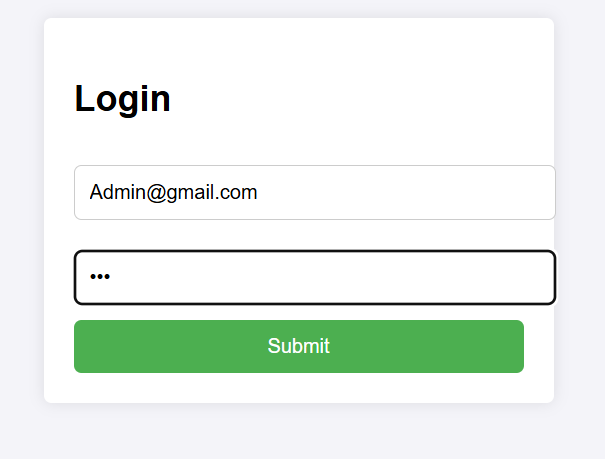
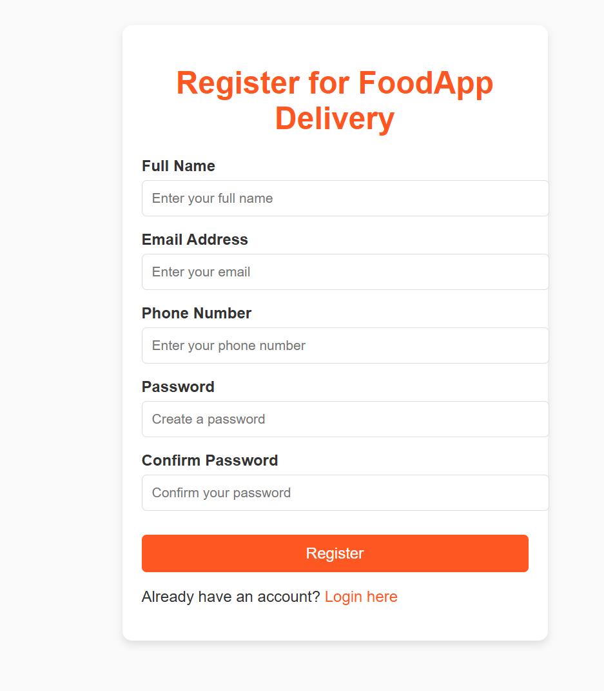
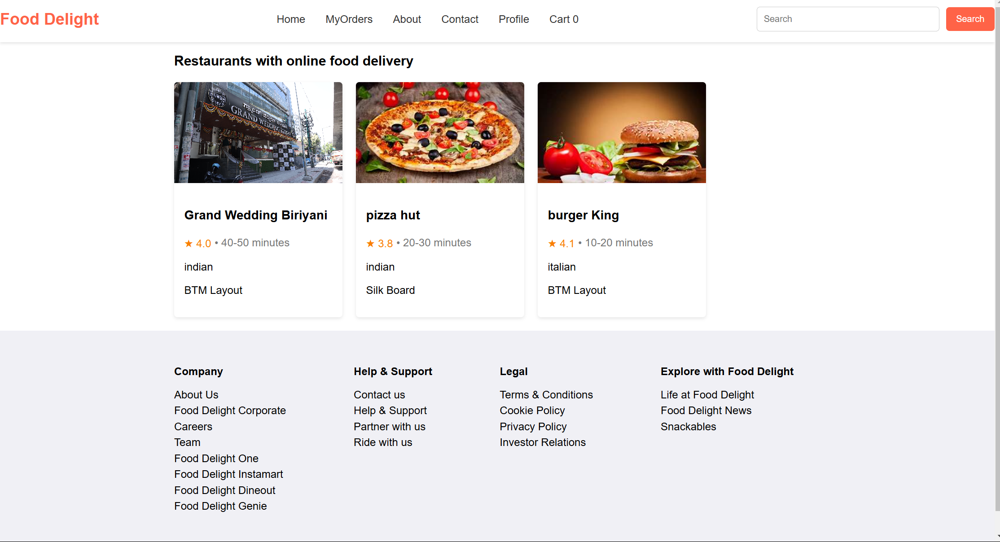
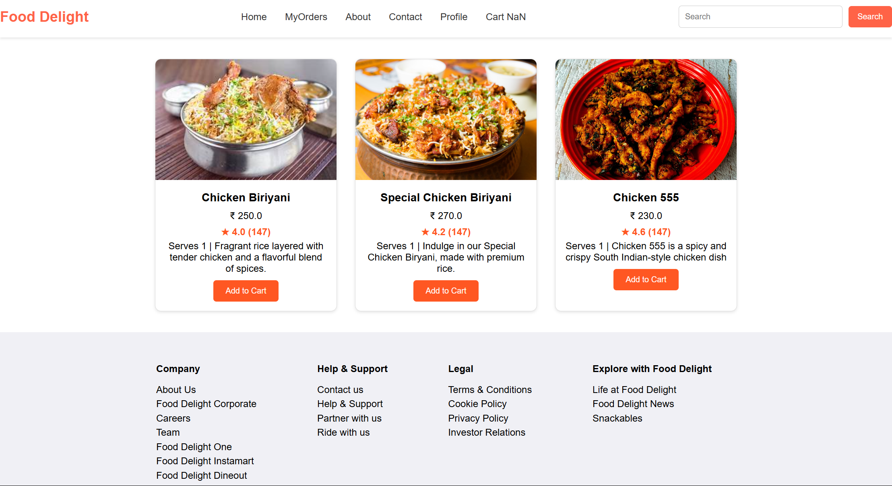
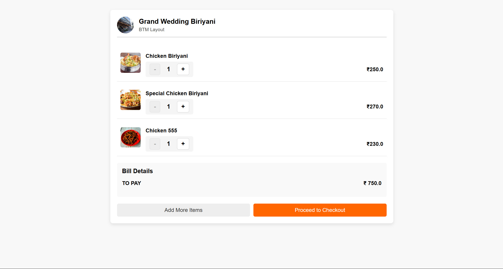
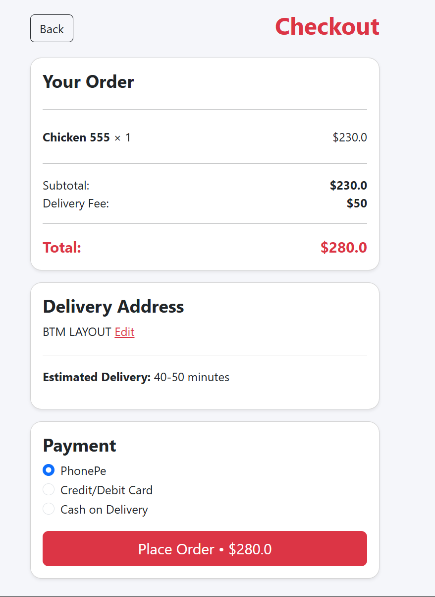
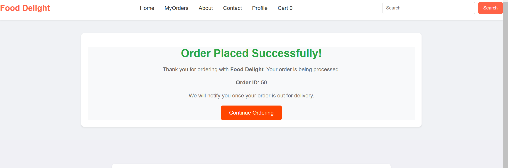
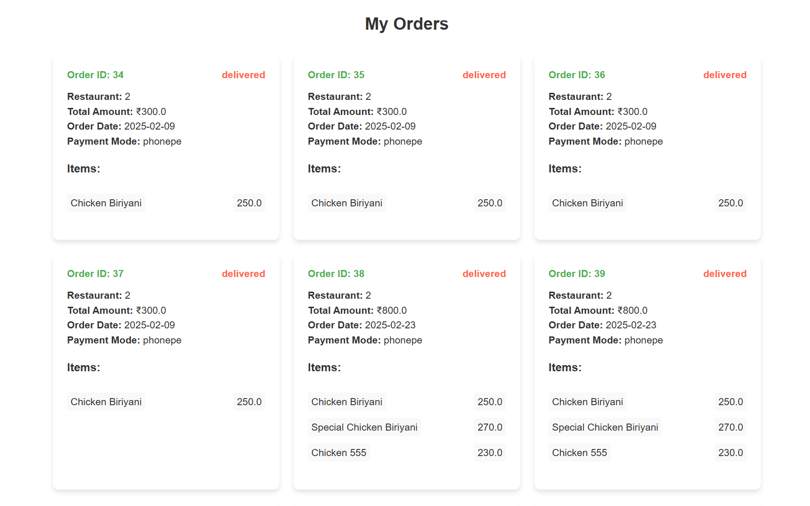

# Food Delivery Web Application

## Overview

This project is a full-stack Java web application for a food delivery system, designed to manage user profiles, orders, and restaurants. It provides users with a personalized experience to track their orders, manage their cart, and explore available restaurants.

The application is built using Java, JSP, Servlets, Hibernate, and MySQL for backend functionality, while the frontend is designed using HTML, CSS, and JavaScript for a responsive and interactive experience.

## Features

- **Authentication**: User login and registration functionality is available.
- **User Profile Management**: Users can view and update their personal information, such as name, email, phone number, and delivery address.
- **Order Management**: Users can view recent orders, including order items and total cost.
- **Restaurant Browsing**: Users can explore available restaurants and browse their menus.
- **Cart**: Users can add items to their cart and proceed to checkout.
- **Order Checkout**: Users can place orders and provide payment information.

## Technologies Used

- **Backend**:
  - Java (JSP, Servlets)
  - JDBC 
  - MySQL Database
- **Frontend**:
  - HTML, CSS
  
- **Other Tools**:
  - Google Chrome Developer Tools
## Installation

- **Clone** the repository to your local machine. 
- Set up a **MySQL** database and using the jdbc to create, update, select and delete operations 
- Run the project using your preferred **IDE** (e.g., **Eclipse**) on **apache tomcat** server.
- Access the application using the provided URL: `http://localhost:8080/FoodDelight/` 

## Screenshots

